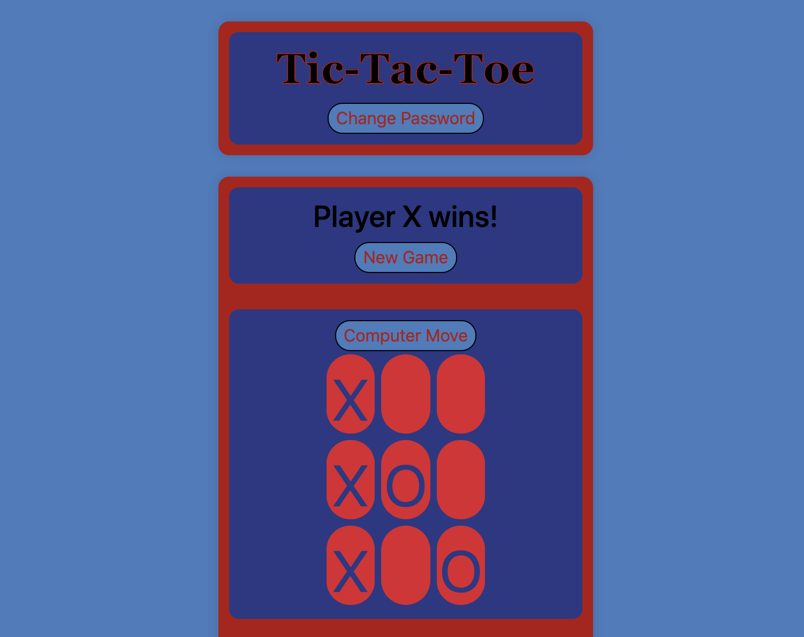
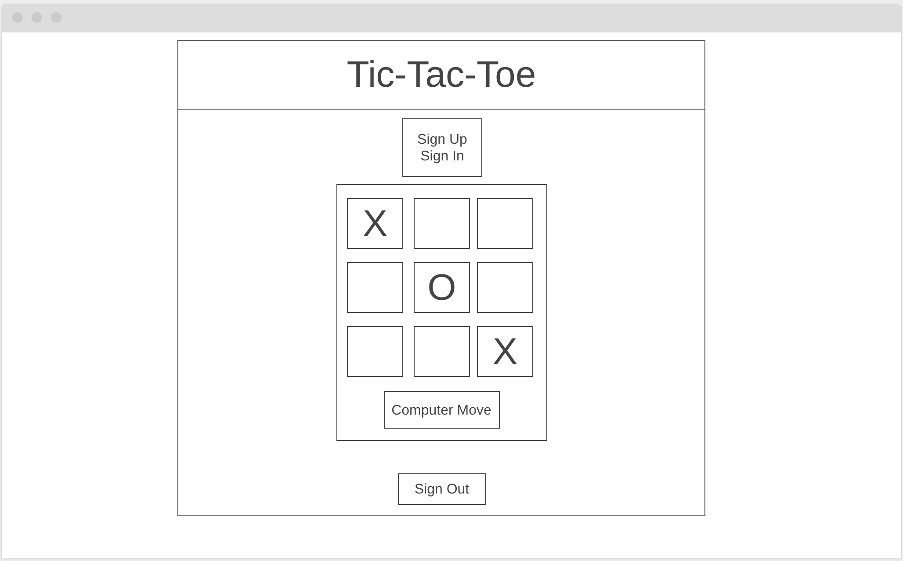

# Tic-Tac-Toe

This is my very first project as a developer. The game itself may seem simple, but road to creating this application has had its fair share of bumps.

### Game Board View

## Important Links

[Tic Tac Toe Deployed Site](https://gmorse19.github.io/tic-tac-toe-GMorse19/)

## Resources

I relied on a number of tools to build my project. Mostly, I referred to documents provided by a full immersive program I am attending at General Assembly in Boston MA.

I also used a great deal of internet searches, which returned sources such as Stack Overflow, Mozilla and many more.

I used the jquery library and bootstrap to help build some of the functions and features.

Some of my greatest resources were my fellow cohorts and my instructors. Words of encouragement go a long way!

## Planning

I attempted to take a very methodical approach to this project.

I began with a wire frame outline of how I wanted the UI to appear and then proceeded to draw up my user stories. These two tools helped me to map out the functionality I would need to begin my first step, which would be setting up a directory structure. I wanted to keep things as modular as possible.

#### User Stories

- As a user, I want to sign-up and sign-in.
- As a user, I want to begin a game.
- As a user, I want to choose which space to place a marker.
- As a user, I expect to see how many games I've played.
- As a user, I expect to sign-out.

#### Wire Frame

My next step was to create my html. Using my wire frame as a guide, I mapped out the form fields I would need and created a game board using bootstrap.

When the look of my page resembled my wire frame mock up, I began the difficult task of setting up my API calls. This was by far the most difficult part of the process for me.

After achieving most of the API calls, I realized I would need to alter my plan a bit and begin working on my game engine. I couldn't be too sure of how my API calls would work until I knew how my game would work.

I figured most of the game logic out and then worked the rest of my API calls and game logic in tandem.

I finished the project with a counter that will count how many times a specific user has played the game and then proceeded to clean up my code as best as I could.

## Unsolved problems

I'd like to create a multi-player option.

I'd like to count the amount of wins a user has.

I'd like to create a CPU player option.

I'd like to make it look a little nicer.
